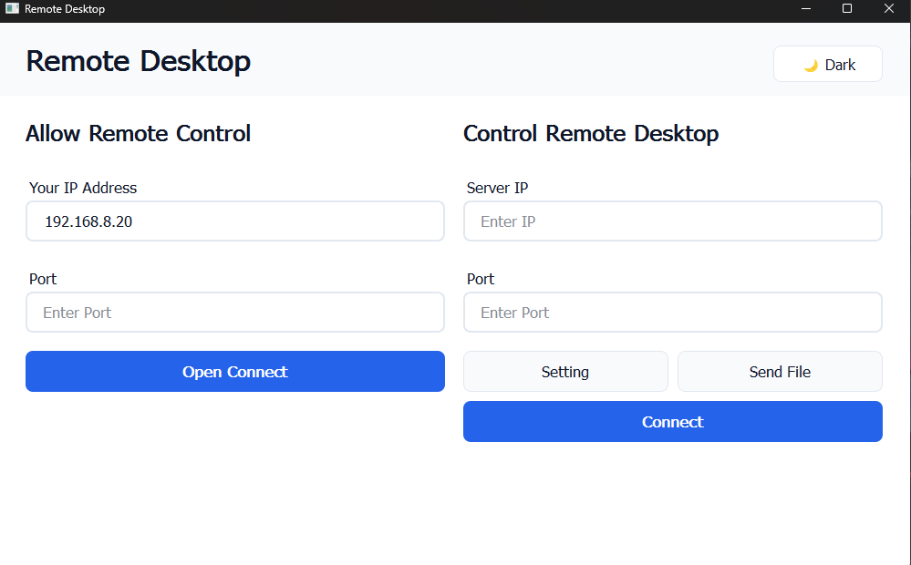
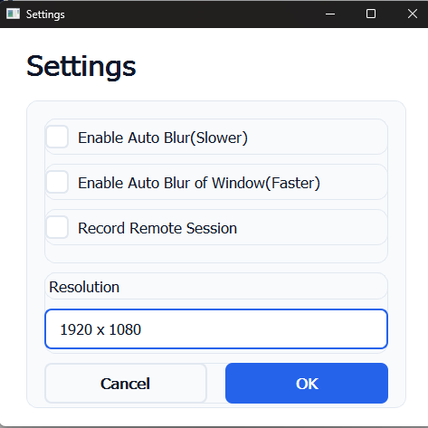

# 🖥️ Remote Desktop Application

A peer-to-peer remote desktop application built using Python and PyQt6. This tool allows users to view each other's screens,with real time sensitive data redaction.

---

## 🚀 Features

- ✅ Real-time screen sharing  
- ✅ Peer-to-peer connection   
- ✅ File Sharing
- ✅ Realtime Data Redaction
- ✅ Simple and responsive GUI using PyQt6  

---

## 📸 Screenshots


### 🔐 Login Screen


### 🖥️ Remote Desktop Settings View



---

## 🛠️ Installation & Setup

### Prerequisites
- Python 3.8 or above
- pip package manager

### 1. Clone the Repository
```bash
git clone https://github.com/isdevit/rlxViewer.git
cd rlxViewer
```

### 2. Install Dependencies
```bash
pip install -r requirements.txt
```

### 3. Run the Main file
```bash
python main.py
```


---


## ⚙️ Technologies Used

- Python  
- PyQt6  
- Socket Programming  
- OpenCV, PIL (for screen capture)  
- PyAutoGUI, Mouse, Struct  
- AES Encryption (via `cryptography` library)  

---

## 🔮 Future Enhancements

- Audio streaming  
- Screen control via mouse/keyboard input  
- Cloud-based relay server for NAT traversal  
- Mobile client support  

---

## 📄 License

This project is licensed under the MIT License. See the [LICENSE](LICENSE) file for details.

---


